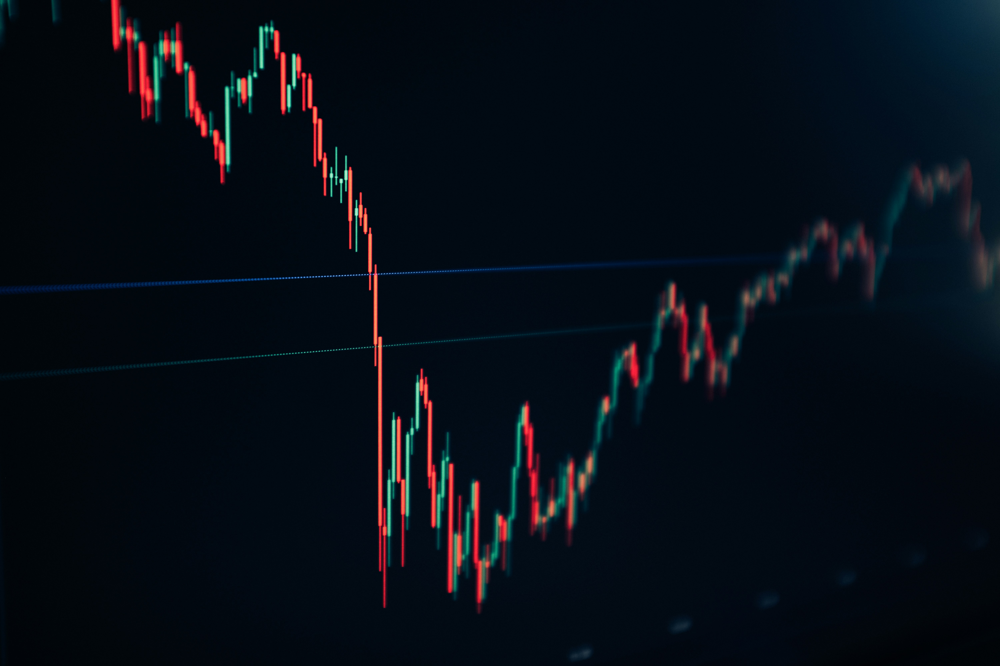

[](https://opensource.org/licenses/MIT)
[](https://www.youtube.com/watch?v=CXrD4rAHZyE)
[](https://www.rust-lang.org/)
[](https://docs.docker.com)
[](https://docs.docker.com/compose)

# 

<div align="center">
<h2>💼 Algorithmic Trading Simulator in Rust 💼</h2>
</div>

_Project was developed as part of course 'Programming 2' at the 
University of Ljubljana, Faculty of Mathematics and Physics, during the 
academic year 2024/2025. It aims to simulate an simple algorithmic trading
strategy using Rust programming language._

**🔴 Disclaimer:** Repository is for educational and research purposes
only and should not be considered financial advice. The system is not 
connected to live exchange APIs, and no real trading occurs - all 
operations are simulated.

## 🦀 Why Rust?
Implemention was done in Rust as part of the course curriculum to
gain familiarity with systems programming concepts, memory safety, and the
sheer joy of fighting with the borrow checker until 3 AM! 😅

## 📚 Essentials

- **What is a Candlestick (Kline)?** <br>
    [Candlestick](https://en.wikipedia.org/wiki/Candlestick_chart) also refered 
    to as kline, is a financial charting tool that displays the high, low, 
    open, and maybe additional data of a security or asset for a specific period.
    Each candlestick consists of:
    - Body: range between opening and closing prices
    - Wicks: highest and lowest prices during given timeframe
    - Color: typically 🟢/⚪ for rising prices and  🔴/⚫ for declining prices

- **What is timeframe in trading teminalogy?** <br>
    In trading terminology, a [timeframe](https://www.investopedia.com/articles/trading/07/timeframes.asp)
    refers to the duration of time represented 
    by each data point (e.g. candlestick) on a financial chart. 
    
    For example, in a 5-minute timeframe, each candlestick captures the highest 
    price, lowest price, opening price (at the start of the 5-minute interval)
    and closing price (at the end of the 5-minute interval).

- **What strategy is used in this project's trading simulation?** <br>
    Implemented strategy is called [SMA crossover](https://en.wikipedia.org/wiki/Moving_average_crossover),
    which relies on the Simple Moving Average, a widely recognized indicator for identifying market trends.
    Read more under next section.

- **Where is kline-data acquired from in trading simulation?** <br>
    Trading simulation uses market data from the cryptocurrency
    trading exchange [Binance](https://en.wikipedia.org/wiki/Binance).  
    Both real-time and historical market data are provided for free with
    [API access](https://www.binance.com/en/binance-api),
    making it an ideal source for this project. So, all kline data is fetched
    directly via their public REST API.

- **How does implemented trading simulation works?** <br>
    Initially, market data is fetched from the Binance exchange via its REST API.
    Then, Rust framework [Tokio](https://tokio.rs/), spawns a cron process to manage asynchronous HTTP
    requests at the end of each minute. Fetched data is sent to a channel and stored
    in a [PostgreSQL](https://www.postgresql.org/) database. 
    Subsequently, parameters are calculated to generate a signal,
    determining whether to enter, hold, or exit a trading position. Each
    position's entry and exit are logged in the database for operation and
    future analysis.

## 🧮 Strategy Rigorous Formulation 

Formally, let $`\{ P_{c,t-i} \}_{i \in \mathbb{N}}`$ represent a time series of closing
prices for a financial asset, where $`P_{c,t-i}`$ denotes the closing price 
of the candlestick at time $`t-i`$, with $`t`$ being the current time.
The Simple Moving Average with lookback $`n`$ at time $`t`$, denoted 
$`\text{SMA}_t(n)`$, is defined as:

$$ SMA_t (n) = \frac{1}{n} \sum_{i=0}^{n-1} P_{c,t-i} $$
   
SMA crossover strategy uses combination of two simple moving averages with distinct 
lookback periods, commonly referred to as the `fast SMA` 
(with the shorter lookback period) and the `slow SMA` 
(with the longer lookback period). Since implemented strategy operates in 
a spot trading environment, without derivatives, it excludes betting 
on the depreciation of the financial asset. So, positions are limited 
to long buys at spot price only, with no option for short selling.

Given the discrete nature of the strategy—dependent on the selected timeframe 
(e.g. 1-minute candlesticks) we can rigorously define the buy signal using 
an indicator function. Let $`n_f, n_s \in \mathbb{N}`$ denote the lookback
periods for the fast and slow SMAs, respectively, with $`n_s > n_f`$. Then
buy signal at time $`t = T_b`$ occurs when the fast SMA crosses above the slow SMA,
formally captured by the indicator function $`\mathbf{1}_T^{\text{buy}}`$, defined 
with Iverson's notation:

$`\qquad \qquad \qquad \quad \quad \forall \, n_f, n_s \in \mathbb{N}\,\,:\,\, \mathbb{1}_{T_b}^{\text{buy}} = \left[\, \text{SMA}_{t-1}(n_f) \, < \, \text{SMA}_{t-1}(n_s) \,\, \land \,\, \text{SMA}_t(n_f) \, > \, \text{SMA}_t(n_s) \, \right] `$

Conversely, the sell signal at time $t = T_s$ occurs when the fast SMA crosses below the slow SMA:

$`\qquad \qquad \qquad \quad \quad \forall \, n_f, n_s \in \mathbb{N}\,\,:\,\, \mathbb{1}_{T_s}^{\text{sell}} = \left[\, \text{SMA}_{t-1}(n_f) \, > \, \text{SMA}_{t-1}(n_s) \,\, \land \,\, \text{SMA}_t(n_f) \, < \, \text{SMA}_t(n_s) \, \right] `$

Additionaly, in the context of a stochastic process, the times $T_b$ and $T_s$ 
represent stopping times, marking the moments when the crossover conditions 
are first satisfied for buy or sell signals, respectively.

## 🛠️ Setup Guide

- 📋Pre-requisites:
    - [Rust 1.70+](https://www.rust-lang.org/tools/install)
    - [Docker 20.10+](https://docs.docker.com/get-docker/)
    - [Docker Compose 2.0+](https://docs.docker.com/compose/install/)

- 🔧 Environment Configuration:
    
    1. 🛠 Configure Environment Variables
    ```bash
    cp .env.copy .env
    ```
  
    2. 🐳 Deploy Docker Compose Services
    ```bash
    docker compose up -d
    ```
>[!NOTE]
> Current configuration ([`docker-compose.yml`](./docker-compose.yml)) defines
a service which deploys PostgreSQL 17.5 database container with named volume. 
This way we have persistent storage, which can be used 
across container restarts.

> [!TIP]
> Before proceeding with any operations, ensure the Docker service is running
> and verify its status.
> 
> ```bash
> docker ps --filter "name=postgres_db"
> ``````

## 💨 Execution

- 🚀 Run Trading Simulation:
    ```bash
    cargo run -- trade
    ```

- 📊 Run Backtest Analysis:
    ```bash
    cargo run -- backtest
    ```

## 💡 Advisors
Project was developed under the guidance of:
- doc. dr. Matija Pretnar
- asist. Filip Koprivec
- asist. Gašper Žajdela
